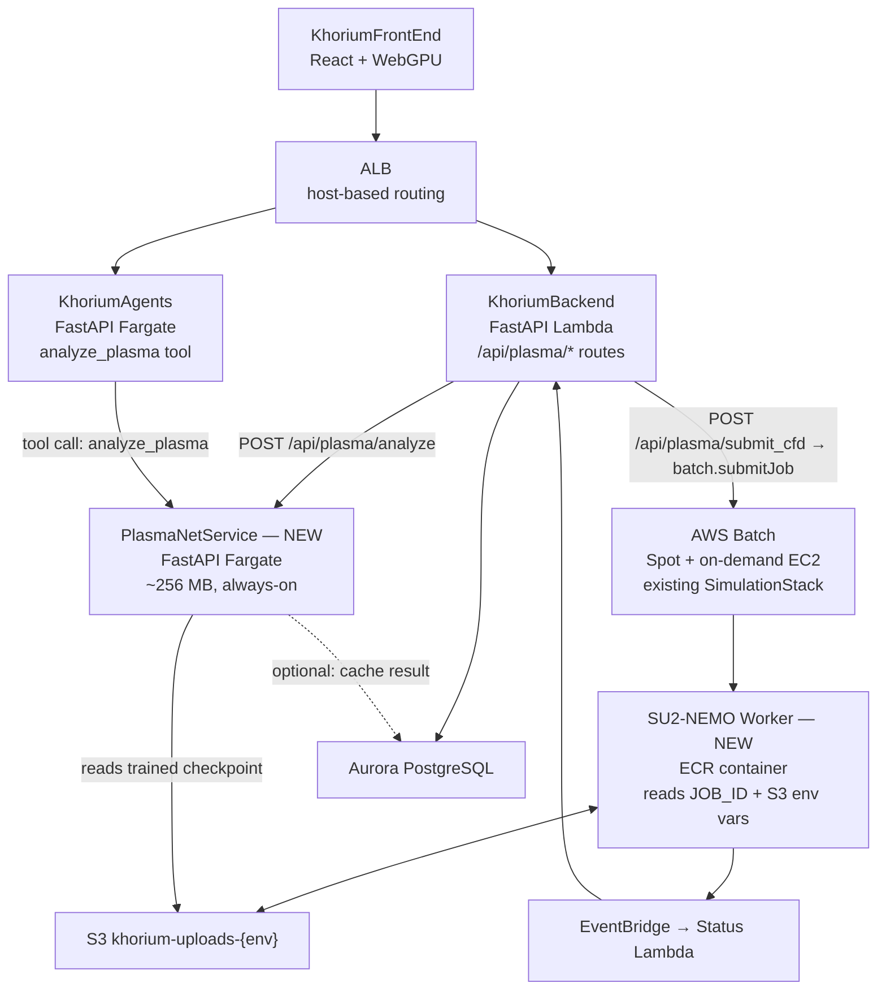

# PlasmaNet SimOps Integration Design

PlasmaNet slots into the Khorium SimOps pipeline at two layers: an always-on
Fargate service for sub-second parametric predictions, and an AWS Batch worker
for full SU2-NEMO coupled-chemistry CFD runs. This document covers the
cross-repo architecture, the Batch vs Fargate tradeoff for NEMO sweeps, the
end-to-end artifact flow, the API surface KhoriumBackend exposes, and the S3
storage layout.

**Status:** Design complete; implementation begins at roadmap milestone I-1.
**Last verified:** 2026-04-24
**Owner:** Yarden Elias

For the PlasmaNet package architecture and physics stack, see
[PLASMANET_NOTION.md](../docs/PLASMANET_NOTION.md).
For the full forward roadmap and milestone schedule, see
[ROADMAP_SIMOPS_INTEGRATION.md](../docs/ROADMAP_SIMOPS_INTEGRATION.md).
For KhoriumContext conventions used below, see the
[KhoriumContext designs/](https://github.com/KhoriumAI/KhoriumContext/tree/main/designs) directory.

---

## Where PlasmaNet Sits in the Khorium Stack

PlasmaNet adds two new components to the existing Khorium architecture.
Everything else — ALB routing, RDS Aurora, S3 uploads bucket, AWS Batch
compute environment, EventBridge status pipeline — is reused unchanged.



**Layer A — PlasmaNetService (Fargate, always-on):**
Sub-second plasma prediction using the trained NN surrogate plus the
analytical sheath + LOS stack. No CFD job needed. 256 MB RAM, <1 s latency
including 64-sample Monte Carlo UQ. Routes: `/predict`, `/health`.

**Layer B — SU2-NEMO Worker (Batch EC2):**
Full coupled two-temperature CFD for flight conditions where equilibrium
overpredicts by >1 order (Mach 18+, below 65 km). 5–32 GB RAM, 20 min –
4 h runtime. Plugs into the existing `SimulationStack` Batch job queue
alongside the OpenFOAM worker — same container env-var contract, different
image.

---

## AWS Batch vs ECS Fargate for SU2-NEMO Case Sweeps

NEMO jobs are fundamentally different from the PlasmaNet inference service.
Each sweep point is a self-contained CFD run: it needs large memory, a burst
of compute, and has no long-idle periods between runs.

| Criterion | AWS Batch (EC2) | ECS Fargate |
|---|---|---|
| **RAM per job** | 5–32 GB (large mesh at Mach 22+) | Max 120 GB — fits, but Fargate billing is per-second regardless of idle |
| **Instance type** | `c5.4xlarge` (16 vCPU / 32 GB) via compute-optimized fleet | Fargate only: no `c5` family, forced onto `m`/`r` families — 15–25% higher $/vCPU-hr |
| **Cost at 20–60 min runtime** | Spot ~$0.15–0.45/run; on-demand ~$0.50–1.50/run | ~$0.90–2.70/run on equivalent vCPU/RAM — 2–3× more expensive |
| **Scale to zero** | Job queue drains to zero naturally — no cost between sweeps | Service minimum task count = 1 unless explicitly set to 0 (cold-start latency) |
| **Spot interruption handling** | Native: Batch retries on a second CE (`order: 2` on-demand fallback) | Must implement retry logic manually |
| **Status tracking** | EventBridge `Batch Job State Change` → existing Status Lambda | Custom SQS + CloudWatch events |
| **Multi-job DOE sweep** | Array jobs via `batch.submitJob(arrayProperties.size=N)` | N separate task launches — more API calls, no native array |

**Decision: AWS Batch.** SU2-NEMO case sweeps belong on Batch for the same
reasons OpenFOAM does. The existing `SimulationStack` (Spot CE `order: 1`,
on-demand CE `order: 2`) is reused with a second job definition. The only
addition is a new ECR image with SU2-NEMO + Mutation++ bundled.

**Exception — PlasmaNetService stays on Fargate.** The inference service
has the opposite profile: 256 MB RAM, <1 s latency requirement, always-on
for interactive UI. Batch cold-start (30–90 s) would break the UX. Fargate
with a minimum task count of 1 is the right choice.

---

## Artifact Flow: Full Pipeline

One SU2-NEMO CFD run follows this path from request to trained surrogate input:

```
POST /api/plasma/submit_cfd
          │
          ▼
  [1] KhoriumBackend Lambda
      • validate SimulationParams
      • lookup mesh.su2 in meshes table (existing meshgen pipeline output)
      • generate run.cfg via nemo_config.py
      • upload run.cfg → S3: simulations/{jobId}/input/run.cfg
      • batch.submitJob(JOB_ID, INPUT_S3_KEY, OUTPUT_S3_PREFIX, S3_BUCKET)
          │
          ▼
  [2] SU2-NEMO Worker (Batch EC2, Spot)
      • download mesh.su2 + run.cfg from S3
      • SU2_CFD run.cfg  (~20 min – 4 h, AIR-5 or air_11)
      • solution.dat / restart.dat written to local disk
          │
          ▼
  [3] Post-processing (same container)
      • extract_nemo_field() → reads flow.vtu via VTK Python
        - fields: T_tr, T_ve, rho_N2, rho_O2, rho_N, rho_O, rho_NO, rho_e
        - applies Saha ionisation per cell to get ne, ν_c
        - returns UnstructuredField (ne + ν_c at every sampled cell)
      • scan_aspect() → LOS integration at 0–180° in 15° steps
      • chemistry_uq.py → 64-sample LHS over T, p uncertainty → UQ bands
      • DetectabilityReport serialized to JSON
          │
          ▼
  [4] Upload artifacts to S3
      simulations/{jobId}/output/
        ├── flow.vtu               full SU2-NEMO solution (T_tr, T_ve, species)
        ├── ne_field.npz           UnstructuredField (ne, nu_c per cell)
        ├── detectability.json     DetectabilityReport (aspect scan + UQ)
        ├── aspect_scan.json       per-angle attenuation + status
        └── history.csv            convergence history (residuals + iter)
          │
          ▼
  [5] EventBridge → Status Lambda
      • SUCCEEDED → simulations.status = completed
      • FAILED    → simulations.status = failed
                    record container.reason in error_message
          │
          ▼
  [6] KhoriumFrontEnd polls GET /simulations/{id}
      • on complete: fetch detectability.json presigned URL
      • render polar attenuation plot + UQ envelope

  [7] (Async) Training pipeline
      • ne_field.npz added to NEMO training batch
      • once batch complete: retrain PlasmaNet v2 on NEMO-derived ne(x,y,z)
      • new checkpoint uploaded → S3: checkpoints/{version}/model.pt
      • PlasmaNetService Fargate task restarted with new checkpoint path env var
```

---

## API Surface

KhoriumBackend exposes three PlasmaNet-specific routes. All use the same
Stytch JWT auth and follow the OpenAPI-generated client pattern from
[api-contract.md](https://github.com/KhoriumAI/KhoriumContext/blob/main/designs/api-contract.md).

### `POST /api/plasma/analyze` — Instant prediction (no CFD)

Routes to PlasmaNetService Fargate. Returns in <1 s.

```python
# Request
class PlasmaAnalyzeRequest(BaseModel):
    vehicle: VehicleGeometry          # nose_radius_m, half_angle_deg, length_m
    flight: FlightCondition           # mach, altitude_km, sideslip_angle_deg
    radar: RadarParams                # frequency_hz, aspect_angles_deg
    uncertainty: UQConfig             # enabled: bool, n_samples: int = 64

# Response
class DetectabilityReport(BaseModel):
    stagnation: StagnationState       # T_tr_K, T_ve_K, p_Pa, ne_m3, fp_GHz
    uq: UQBand | None                 # ne_P05, ne_P50, ne_P95, log10_ne_std
    aspect_scan: list[AspectResult]   # per angle: angle_deg, attenuation_dB, status
    overall_status: OverallStatus     # DETECTABLE | DEGRADED | BLACKOUT | UQ-dependent
    worst_case: AspectResult
    runtime_seconds: float
    plasmanet_version: str
    engine: Literal["plasmanet_nn"]
```

### `POST /api/plasma/submit_cfd` — Full SU2-NEMO CFD job

Enqueues a Batch job. Returns 202 Accepted with `simulation_id` for polling.

```python
class PlasmaSubmitCFDRequest(BaseModel):
    mesh_id: UUID                     # pre-generated by meshgen pipeline
    flight: FlightCondition
    plasma: PlasmaAnalysisParams      # gas_model, radar_frequency_hz, aspect_angles, include_uq
    solver: Literal["su2_nemo"] = "su2_nemo"

# Response: 202 Accepted
class PlasmaSubmitCFDResponse(BaseModel):
    simulation_id: UUID
    batch_job_id: str
    status: Literal["queued"]
    estimated_runtime_minutes: int    # derived from mesh node count + solver
```

### `GET /api/plasma/benchmark/ram_c` — Live RAM-C self-test

Runs the full `ram_c_validation.py` harness and returns predicted vs
published ne at 4 altitudes × 3 frequencies. Intended for the SimOps UI
demo and CI regression checks.

```python
# Response
class RamCBenchmarkResult(BaseModel):
    generated_at: datetime
    cases: list[RamCCaseResult]       # altitude_km, mach, frequency_ghz,
                                      # ne_predicted_m3, ne_reference_m3,
                                      # log10_error, status_match: bool
    summary: dict                     # pass_count, fail_count, max_log10_error
```

---

## S3 Storage Layout

Extends the existing `khorium-uploads-{env}/simulations/{jobId}/` layout
from [simulation-infra.md](https://github.com/KhoriumAI/KhoriumContext/blob/main/designs/simulation-infra.md).

```
khorium-uploads-{env}/
│
├── simulations/{jobId}/
│   ├── input/
│   │   ├── mesh.su2                  SU2 mesh (from meshgen pipeline)
│   │   └── run.cfg                   SU2-NEMO config (generated by nemo_config.py)
│   └── output/
│       ├── flow.vtu                  Full solution: T_tr, T_ve, species fractions
│       ├── ne_field.npz              UnstructuredField: ne + ν_c per sampled cell
│       ├── detectability.json        DetectabilityReport (aspect scan + UQ bands)
│       ├── aspect_scan.json          Per-angle attenuation + DETECTABLE/DEGRADED/BLACKOUT
│       └── history.csv               Convergence residuals per iteration
│
├── meshes/{meshId}/
│   └── mesh.su2                      SU2 mesh file (also written here by meshgen worker)
│
├── plasma_checkpoints/
│   ├── plasmanet_v1/
│   │   └── model.pt                  PlasmaNet v1 checkpoint (stagnation-only NN)
│   ├── plasmanet_v2/
│   │   └── model.pt                  PlasmaNet v2 (6-input: Mach, alt, R_n, p, cone_angle, length)
│   └── plasmanet_nemo/
│       └── model.pt                  Future: retrained on NEMO-derived ne(x,y,z) fields
│
└── plasma_analyses/{analysisId}/
    └── report.json                   DetectabilityReport for instant-mode (no CFD) analyses
```

**Checkpoint lifecycle:** PlasmaNetService reads `MODEL_S3_KEY` from its
container env var at startup. To deploy a new checkpoint, upload to
`plasma_checkpoints/{version}/model.pt`, update the CDK stack env var, and
trigger a Fargate service update (rolling restart, no downtime). No build
required.

**Restart files:** SU2 restart files (`restart.dat`) are not committed to
the repo (gitignored) and are not uploaded to S3 by default — they are
transient. If P1 checkpointing lands (simulation resume on Spot
interruption), add `restart.dat` to the upload list before the worker exits.

---

## Database Schema

Extends the schema from
[meshgen-database.md](https://github.com/KhoriumAI/KhoriumContext/blob/main/designs/meshgen-database.md).
No existing tables are modified.

```sql
-- New table: plasma_analyses
-- Stores instant-mode (no CFD) detectability reports.
-- CFD-grounded reports are linked from the simulations table.
CREATE TABLE plasma_analyses (
    id                  UUID PRIMARY KEY,
    user_id             TEXT NOT NULL,                    -- Stytch user ID
    simulation_id       UUID REFERENCES simulations(id),  -- NULL for instant mode
    params              JSONB NOT NULL,                   -- PlasmaAnalyzeRequest
    report              JSONB NOT NULL,                   -- DetectabilityReport
    engine              TEXT NOT NULL,                    -- "plasmanet_nn" | "su2_nemo"
    plasmanet_version   TEXT,
    ne_field_s3_key     TEXT,                             -- CFD mode only
    created_at          TIMESTAMPTZ NOT NULL DEFAULT now(),
    completed_at        TIMESTAMPTZ,
    deleted_at          TIMESTAMPTZ
);

CREATE INDEX idx_plasma_analyses_user   ON plasma_analyses(user_id)        WHERE deleted_at IS NULL;
CREATE INDEX idx_plasma_analyses_sim    ON plasma_analyses(simulation_id)  WHERE simulation_id IS NOT NULL;

-- Extend simulations table (two additive columns, nullable — safe migration)
ALTER TABLE simulations
    ADD COLUMN solver               TEXT DEFAULT 'openfoam',
    ADD COLUMN plasma_analysis_id   UUID REFERENCES plasma_analyses(id);
```

All conventions from the existing schema apply: UUID PKs, soft deletes via
`deleted_at`, `user_id TEXT` (Stytch format), JSONB for variable-schema data.

---

## CDK Infrastructure Changes

All changes are additive to existing stacks in KhoriumCDK.
For colocation policy, see
[cdk-colocation.md](https://github.com/KhoriumAI/KhoriumContext/blob/main/designs/cdk-colocation.md).

| Stack | Change | Notes |
|---|---|---|
| `PlasmaNetServiceStack-{env}` | **New stack** | ECS Fargate service, 256 MB / 0.5 vCPU, ALB target group `/api/plasma/analyze`, `MODEL_S3_KEY` env var |
| `SimulationStack-{env}` | Add `simulation-{env}-su2nemo` job definition | Same Spot+on-demand CE as OpenFOAM; different ECR image; `MPP_DATA_DIRECTORY` + `LD_LIBRARY_PATH` env vars |
| `JobStatusStack-{env}` | No change | Status Lambda already handles EventBridge → `simulations.status`; just gets a new `solver=su2_nemo` row |
| `DatabaseStack-{env}` | Schema migration via `DbMigrateStack` | Alembic migration for `plasma_analyses` table + `simulations` ALTER |
| `MonitoringStack-{env}` | Add PlasmaNetService alarms | CPUUtilization > 80%, no running tasks; RAM-C benchmark drift alarm (log₁₀ error > 0.5 at 81 km) |

---

## KhoriumAgents Tool Binding

The `analyze_plasma` Pydantic AI tool lets the LLM answer questions like
*"Would a StarLink satellite detect an HGV at Mach 10 from directly above?"*

```python
@tool
async def analyze_plasma(
    mach: float,
    altitude_km: float,
    nose_radius_m: float,
    radar_frequency_ghz: float = 12.0,
    aspect_angles_deg: list[float] | None = None,
) -> DetectabilityReport:
    """
    Predict radar detectability of a hypersonic vehicle at the given
    flight condition and radar geometry. Returns attenuation in dB at
    each aspect angle with P05/P95 uncertainty bands.
    """
    return await plasma_client.post("/predict", json={...})
```

The tool calls the PlasmaNetService directly (not through KhoriumBackend)
to avoid an extra network hop inside the VPC.

---

## Observability

Follows the existing pattern from
[observability.md](https://github.com/KhoriumAI/KhoriumContext/blob/main/designs/observability.md).

| Metric | Source | Alarm threshold |
|---|---|---|
| PlasmaNetService tasks running | ECS RunningTaskCount | < 1 for 1 min → page |
| PlasmaNetService CPU | ECS CPUUtilization | > 80% for 5 min → Slack warn |
| Instant analyze latency p99 | Custom EMF `PlasmaAnalyze.LatencyMs` | > 3000 ms for 5 min → Slack warn |
| CFD job success rate | Batch EventBridge → metric filter | < 90% over 1 h → Slack warn |
| RAM-C benchmark drift | CI cron: `pytest tests/test_ram_c_benchmark.py` | log₁₀ error at 81 km > 0.5 → alarm |

The RAM-C benchmark drift alarm is the most operationally important. If a
checkpoint update degrades the 81 km prediction past 0.5 log₁₀ error, it
fires before the new model reaches production.

---

## Decision Log

| Decision | Alternatives | Why |
|---|---|---|
| Batch for NEMO sweeps, Fargate for PlasmaNetService | Fargate for both | NEMO jobs need c5-class EC2, Spot pricing, and native array jobs — Fargate can't provide these. Inference service needs <1 s latency — Batch cold-start (30–90 s) would break interactive UI. Different job profiles → different infrastructure |
| Reuse existing SimulationStack Batch queue | New dedicated Batch queue for plasma | One queue, one monitoring surface. Existing `simulation-status` Lambda already handles arbitrary `solver` values in the DB — no changes needed there |
| PlasmaNetService Fargate as a separate service from KhoriumAgents | Bundle into KhoriumAgents | Different scaling profile (plasma predict = CPU-bound, 256 MB; agent chat = GPU optional, 512 MB+). Separate service lets each scale independently and fail independently |
| `plasma_analyses` as a new table | Store report in `simulations.result_summary JSONB` | Plasma reports have a different, richer schema than simulation results. New table keeps concerns separate, avoids bloating `simulations` |
| `solver` column on `simulations`, not a discriminated union | Separate `plasma_simulations` table | Single `simulations` table is simpler; the `solver` column and `plasma_analysis_id` FK are additive and nullable — no existing rows break |
| Checkpoint in S3, not baked into image | Bake model.pt into ECR image | Model retraining happens far more often than infra changes. Uploading a new .pt file + Fargate rolling restart is faster and cheaper than a full image rebuild + ECR push |

---

## Summary

| Aspect | Detail |
|---|---|
| New components | `PlasmaNetService` Fargate, `SU2-NEMO Worker` Batch image, `plasma_analyses` DB table, 3 API routes |
| Unchanged components | ALB, RDS Aurora, S3 bucket, Batch CE, EventBridge → Status Lambda, Stytch auth, observability stack |
| Key Batch decision | NEMO jobs (~5 GB RAM, 20–60 min) need Spot EC2 + array jobs + native retry — Fargate is 2–3× more expensive and lacks c5 instances |
| Artifact flow | `.cfg + .su2 → SU2-NEMO → flow.vtu → extract_nemo_field → ne_field.npz → aspect scan → DetectabilityReport → S3` |
| Training loop | NEMO ne_field outputs accumulate in S3; batch retrain of PlasmaNet NN uploads new checkpoint; Fargate rolling restart picks it up |
| First milestone | I-1: `PlasmaNetServiceStack` + `/api/plasma/analyze` live on staging (no CFD needed) |
