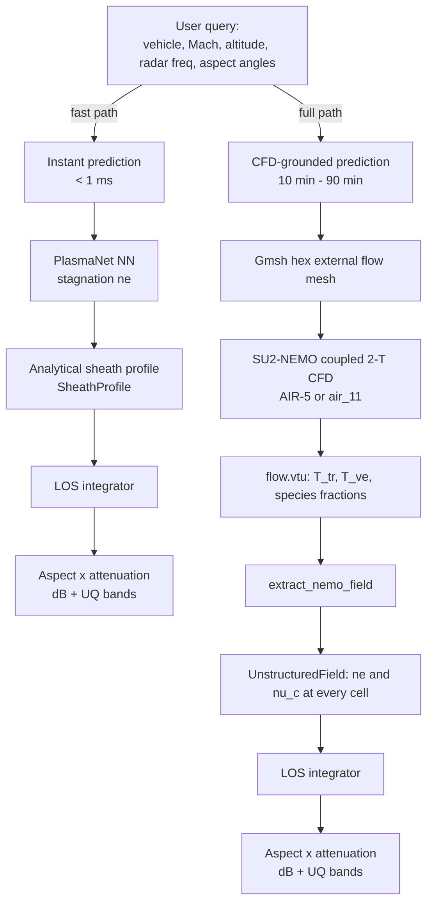
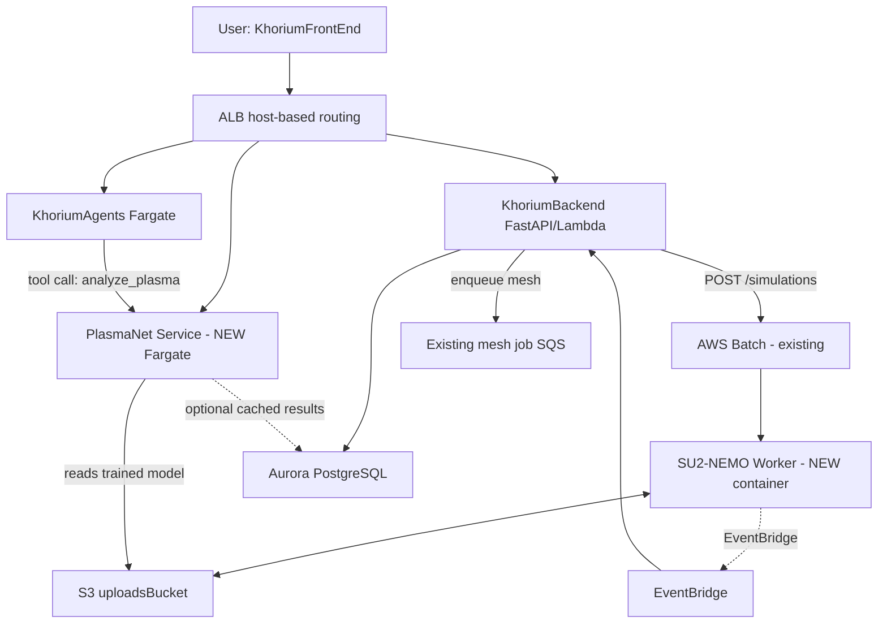

# PlasmaNet — Hypersonic Plasma Detection Platform

> **Fill-out Notion template.** Replace `___` placeholders and `TBD` cells before publishing. Progressive-disclosure style per KhoriumContext conventions — summaries lead, link out to deeper design docs.

| Field | Value |
|---|---|
| Document owner | `___` |
| Status | Active development — physics stack rebuilt, Path C (SU2-NEMO) validated, SimOps integration pending |
| Last updated | 2026-04-23 |
| Linear project | `ENG-___` |
| Primary contact | Yarden Elias |
| Executive sponsor | Aaron Wu |
| External stakeholders | AFRL (Srini Vasan), defense primes (Lockheed, Raytheon, Boeing) |

---

## 1. Executive Summary

PlasmaNet answers one operational defense question: **"Can radar detect this hypersonic vehicle under these flight conditions, from this viewing direction, with what confidence?"**

Below Mach 5 the answer is always yes. Above Mach 12 it is usually no — the vehicle is shrouded in a plasma sheath that blocks radar. The interesting regime is Mach 6–12, where small changes in altitude, vehicle geometry, and viewing angle flip the answer from DETECTABLE to BLACKOUT. This is where StarLink's 12 GHz Ku-band sits, and it is the central uncertainty in modern HGV defense architecture ($100B+ procurement decisions depend on it).

The system takes a vehicle geometry, flight condition (Mach, altitude), and radar (frequency, aspect geometry) as input. It returns the path-integrated attenuation in dB at each viewing angle, with quantified uncertainty bands, in milliseconds. Behind the scenes there is a two-temperature coupled-chemistry CFD stack (SU2-NEMO) for the flow field, a physically-correct electromagnetic wave propagation model for the attenuation, and a neural surrogate (the namesake PlasmaNet) for instant parametric exploration.

As of 2026-04-23: **physics stack validated against RAM-C II at 81 km and 71 km within published measurement uncertainty** (log₁₀ error +0.12 and +0.25). Remaining validation gap at lower altitudes (Mach 20+ at 50–60 km) closes with the SU2-NEMO coupled-chemistry run, which was unblocked on 2026-04-23 after the previous attempt had been stalled for weeks.

---

## 2. The Problem, in Plain English

At Mach 5+, the air in front of a hypersonic vehicle cannot move out of the way fast enough. A bow shock forms, compressing and heating the air to 3,000–15,000 K over a distance of centimetres. In that shock layer:

1. N₂ and O₂ molecules break apart into atoms (*dissociation*).
2. Atoms lose electrons (*ionization*).
3. The free-electron cloud around the vehicle is a plasma.
4. If the plasma's characteristic electron oscillation frequency (*plasma frequency* fₚ) exceeds the radar frequency, the wave is reflected or heavily absorbed.

This has four moving parts:

- **How hot the air gets** depends on the flow (shock strength, body shape).
- **How the air decomposes at that temperature** depends on the chemistry mechanism.
- **How many free electrons there are** depends on ionization kinetics — which are *not* at equilibrium in real flights (the shock-to-body residence time is comparable to the recombination time).
- **Whether the radar can see through it** depends on the path-integrated electron density along the viewing ray — not just the peak — and on frequency.

Getting any one of these wrong by a factor of 10 flips the detection answer. Getting all of them right within a factor of 2 has historically required runs of DPLR or US3D — ITAR-restricted codes that cost $500K/year in licensing. **Our pipeline does this with open-source tools (SU2-NEMO, Cantera, Mutation++) and adds aspect-resolved radar propagation and uncertainty quantification that the legacy tools don't provide.**

---

## 3. Current State (2026-04-23)

### 3.1 Physics stack status

| Layer | Implementation | Status | Validation benchmark |
|---|---|---|---|
| Freestream atmosphere | US Standard Atmosphere 1976, 7 regimes, 0-71 km | Validated | NOAA tables |
| Real-gas stagnation T | Cantera enthalpy inversion | Validated | NASA CEA |
| Stagnation pressure | Rayleigh pitot (pitot post-bow-shock) | Validated | Anderson 2004 ch. 9 |
| Equilibrium chemistry | Cantera Gibbs + 11-species Park/Gupta mechanism | Validated | NASA CEA, Chase 1998 JANAF |
| Saha ionization | NIST partition functions, 20-iteration self-consistent | Validated | Park 1990 Table 7.3 |
| Electromagnetic wave | Complex refractive index in collisional plasma (Gurevich 1978) | Validated | Analytical limits: vacuum, overdense, cutoff |
| Collision frequency | Species-resolved (Itikawa 2005/2009 cross sections) + Spitzer ei | Validated | RAM-C Huber 1967 regime match |
| LOS ray integrator | Adaptive quadrature, axisymmetric + unstructured fields | Validated | Uniform slab exact, parabolic profile convergent |
| Chemistry UQ | Latin hypercube over T, p; 5 Saha partition funcs | Validated | Saha sensitivity vs theoretical ∂log10(ne)/∂log10(T) |
| Coupled-chemistry CFD | **SU2-NEMO (AIR-5 or air_11)** — P_0 of Path C | **Working 2026-04-23** | Blunt cone M10 @ 30 km |

### 3.2 RAM-C II validation (canonical benchmark)

| Altitude | Mach | Predicted ne (m⁻³) | Reference ne (m⁻³) | log₁₀ error |
|:--------:|:----:|:------------------:|:------------------:|:-----------:|
| 81 km | 23.9 | 2.63 × 10¹⁸ | 2.0 × 10¹⁸ (range 1–3.5×10¹⁸) | **+0.12** ✅ |
| 71 km | 23.6 | 1.79 × 10¹⁹ | 1.0 × 10¹⁹ (range 0.5–2×10¹⁹) | **+0.25** ✅ |
| 61 km | 22.5 | 1.65 × 10²¹ | 2.0 × 10¹⁹ (range 1–4×10¹⁹) | +1.92 ⚠️ |
| 47 km | 18.5 | 3.04 × 10²⁰ | 2.0 × 10¹⁹ (range 1.5–3×10¹⁹) | +1.18 ⚠️ |

81–71 km predictions are within published measurement uncertainty. The +1–2 order gap at lower altitudes is the non-equilibrium signature — this is what SU2-NEMO closes (next validation milestone, §6.2).

### 3.3 Known audit resolutions

Six issues surfaced in the 2026-04-23 audit (see `AUDIT_FINDINGS.md`). All resolved:

- [x] Pitot vs isentropic stagnation pressure formula — pitot now default
- [x] Training data NEQ contamination — `use_neq` flag, default off
- [x] Activation energies in chemistry mechanism — fixed units (×R)
- [x] Contradictory DRGEP files — single source of truth
- [x] Saha partition-function degeneracies for N, O⁺ — NIST ASD values
- [x] US Standard Atmosphere regimes — extended to 71 km

### 3.4 Open limitations

- [ ] **RAM-C Mach 20+ lower altitudes:** needs NEMO coupled-chem run to close the +1.9 order gap. Mesh + config scaffolded; first validation milestone next.
- [ ] **Geometry generalization of the NN surrogate:** trained on stagnation-point-only data with a single nose radius. Closes with field-NN retrain once NEMO batch completes.
- [ ] **Very high Mach (25+)**: current mechanism is 11-species air. For Mach 25+ planetary entry, carbon ablation species (C, CO, CN) become relevant (not in scope for HGV detection).
- [ ] **Body surface emissivity and antenna gain** not modelled. Radar link budget analysis assumes isotropic target, which is a first-order approximation.

---

## 4. Architecture

### 4.1 Plasmanet package structure

The standalone Python package (`github.com/yardeli/cadpipe-neural-network`). Everything inference-time runs without cloud dependencies.

```
plasmanet/
├── plasmanet/
│   ├── physics.py              Standard atmosphere, pitot/isentropic pressure, Cantera equilibrium, Saha ionization, plasma frequency, NEQ correction
│   ├── plasma_wave.py          Complex refractive index, attenuation dB/m, phase rad/m, detection status
│   ├── collision_frequency.py  Species-resolved electron-neutral cross sections + Spitzer ei
│   ├── line_of_sight.py        Ray class, Axisymmetric/Cartesian/Unstructured fields, scan_aspect
│   ├── chemistry_uq.py         Latin hypercube MC over T, p; ne quantiles; sensitivity analysis
│   ├── ram_c_validation.py     Canonical RAM-C II harness (4 altitudes × 3 frequencies)
│   ├── cfd_field.py            SU2 Euler and SU2-NEMO VTU readers, real-gas T correction
│   ├── nemo_config.py          SU2-NEMO config generator + env vars
│   ├── detectability.py        Top-level API: vehicle + condition + radar → aspect-resolved attenuation + UQ
│   ├── model.py                PlasmaNet v1 neural surrogate (4 inputs, Mach/alt/R_n/log_p)
│   ├── model_v2.py             PlasmaNet v2 (6 inputs, adds cone angle and body length)
│   └── serve.py                FastAPI inference server
├── scripts/
│   ├── run_nemo_batch.sh       Parallel SU2-NEMO runner for CFD batches
│   └── generate_nemo_batch.py  Config-file generator for the 40-case batch
├── tests/                      73 tests across 8 modules, all passing
└── docs/
    ├── PROJECT_OVERVIEW_POST_AUDIT.md
    ├── ROADMAP_SIMOPS_INTEGRATION.md
    └── SU2_NEMO_FIX.md
```

### 4.2 Data flow for a single prediction



### 4.3 External dependencies

| Dependency | Purpose | Version | Where |
|---|---|---|---|
| Cantera | Equilibrium chemistry + JANAF thermo | ≥ 3.0 | Inference + training |
| SU2 (NEMO branch) | Coupled-chem CFD | 7.5.1 | On compute workers only |
| Mutation++ | SU2-NEMO chemistry/transport library | ≥ 1.0.4 | Linked into SU2-NEMO build |
| Gmsh | Mesh generation | 4.x | Compute workers + geometry tools |
| PyTorch (cpu) | PlasmaNet NN inference | 2.x | Serving container |
| VTK Python | NEMO VTU reading | 9.x | Post-processing pipeline |
| scipy | Interpolation for unstructured fields | any recent | Post-processing |

---

## 5. SimOps / Khorium Integration

**Reference design docs** in KhoriumContext:
- [Architecture Overview](https://github.com/KhoriumAI/KhoriumContext/blob/main/designs/architecture-overview.md)
- [Simulation Infrastructure](https://github.com/KhoriumAI/KhoriumContext/blob/main/designs/simulation-infra.md)
- [Modular Engine Pipeline](https://github.com/KhoriumAI/KhoriumContext/blob/main/designs/modular-engine-pipeline.md)
- [OpenFOAM External Flow](https://github.com/KhoriumAI/KhoriumContext/blob/main/designs/openfoam-external-flow.md)
- [DOE Study](https://github.com/KhoriumAI/KhoriumContext/blob/main/designs/doe-study.md)

### 5.1 How plasmanet plugs in

Plasmanet fits into the existing SimOps pipeline at two layers:

**Layer A — Instant prediction service (new):**
Sub-second responses for interactive UI, parametric sweeps, MOBO objective evaluation. Uses the trained PlasmaNet NN and the analytical sheath + LOS stack. No CFD job needed.

**Layer B — CFD-grounded analysis (reuses existing Simulation Batch infra):**
Full detectability report backed by a real SU2-NEMO coupled-chemistry flow field. Runs on the existing AWS Batch Spot EC2 infrastructure just like OpenFOAM jobs. Plasma-specific post-processing (ne/ν_c per cell, LOS integration, aspect scan) happens in the container.

### 5.2 Integration with Khorium's existing services



### 5.3 New components

| Component | Type | Repo | Rationale |
|---|---|---|---|
| `PlasmaNetService` | ECS Fargate (new stack in KhoriumCDK) | KhoriumCDK + plasmanet serve.py | Always-on, ~256 MB RAM. Serves `/api/plasma/analyze` for instant predictions + small inline Monte Carlo UQ. |
| SU2-NEMO Worker image | ECR container in KhoriumBackend/simops | KhoriumBackend | Plugs into existing `SimulationStack`. Swappable with OpenFOAM image via Batch job-definition override. Reads `JOB_ID`, `INPUT_S3_KEY` etc. from env — same contract as OpenFOAM container. |
| `SolverType` enum in simulation params | KhoriumBackend schema | KhoriumBackend | Adds `"su2_nemo"` alongside `"openfoam"`. Backend picks job-definition based on `SolverType`. |
| `PlasmaAnalysisParams` sub-model on `SimulationParams` | KhoriumBackend schema | KhoriumBackend | Radar-specific inputs: `frequency_hz`, `aspect_angles_deg`, `include_uq`. |
| `plasma_analyses` DB table | Aurora | KhoriumBackend migration | Keyed to `simulation_id`. Stores detectability report JSON + S3 key for full ne(x,y,z) field. |
| `/api/plasma/analyze` endpoint | Lambda | KhoriumBackend | Instant prediction (no CFD). Routes to PlasmaNetService Fargate. |
| `/api/plasma/submit_cfd` endpoint | Lambda | KhoriumBackend | Starts a full SU2-NEMO CFD job via existing Batch infra. |
| `/api/plasma/benchmark/ram_c` endpoint | Lambda | KhoriumBackend | Self-test that runs the RAM-C II harness and returns predicted vs published ne table. |
| Frontend polar attenuation plot | React + WebGPU | KhoriumFrontEnd | Renders aspect-angle sweep with UQ shading. |
| `analyze_plasma` agent tool | KhoriumAgents tool binding | KhoriumAgents | LLM can call the analyze endpoint during chat: *"would a StarLink satellite see an HGV at Mach 10 from above?"* |

### 5.4 Contract: new `SimulationParams` shape

Extends the existing simulation-infra contract with a solver field and plasma sub-params. Follows the KhoriumBackend discriminated-union convention.

```python
class SimulationParams(BaseModel):
    solver: Literal["openfoam", "su2_nemo"]
    mesh_id: UUID                               # pre-generated via meshgen pipeline
    flight_condition: FlightCondition
    plasma: PlasmaAnalysisParams | None = None  # only when solver is su2_nemo

class FlightCondition(BaseModel):
    mach: float                                 # 3-25
    altitude_km: float                          # 15-100
    sideslip_angle_deg: float = 0.0

class PlasmaAnalysisParams(BaseModel):
    gas_model: Literal["AIR-5", "AIR-11"] = "AIR-5"  # AIR-11 = with ions
    radar_frequency_hz: float = 12e9                  # default StarLink Ku-band
    aspect_angles_deg: list[float] | None = None      # default 0-180 every 15°
    include_uq: bool = True
    uq_n_samples: int = 64
```

### 5.5 Contract: new `DetectabilityReport` response

```python
class DetectabilityReport(BaseModel):
    simulation_id: UUID
    status: Literal["completed", "running", "failed"]
    flight_condition: FlightCondition
    radar_frequency_hz: float

    # Stagnation prediction (from CFD or analytical)
    stagnation: StagnationState              # T_tr, T_ve, p, ne, fp

    # UQ band on stagnation ne (None if UQ disabled)
    uq: UQBand | None

    # Aspect-resolved attenuation
    aspect_scan: list[AspectResult]          # per-angle dB + status

    # Overall verdict (may be UQ-dependent)
    overall_status: Literal[
        "DETECTABLE", "DEGRADED", "BLACKOUT",
        "DETECTABLE->DEGRADED (UQ-dependent)",
        "DEGRADED->BLACKOUT (UQ-dependent)",
    ]

    worst_case: AspectResult
    ne_field_s3_key: str | None              # full 3D ne(x,y,z) if CFD mode
    runtime_seconds: float
    plasmanet_version: str
    su2_nemo_gas_model: str | None           # None if instant mode
```

### 5.6 DB schema additions

Follows KhoriumContext's [MeshGen Database](https://github.com/KhoriumAI/KhoriumContext/blob/main/designs/meshgen-database.md) conventions.

```sql
-- New table: plasma_analyses
CREATE TABLE plasma_analyses (
    id UUID PRIMARY KEY,
    simulation_id UUID REFERENCES simulations(id),  -- NULL for instant mode
    user_id TEXT NOT NULL,
    project_id UUID REFERENCES projects(id),
    params JSONB NOT NULL,                          -- PlasmaAnalysisParams + FlightCondition
    report JSONB NOT NULL,                          -- DetectabilityReport
    ne_field_s3_key TEXT,                           -- Full ne(x,y,z) field (CFD mode)
    engine TEXT NOT NULL,                           -- "plasmanet_nn" | "su2_nemo"
    solver_version TEXT,
    created_at TIMESTAMPTZ DEFAULT now(),
    completed_at TIMESTAMPTZ
);

CREATE INDEX idx_plasma_analyses_project ON plasma_analyses(project_id);
CREATE INDEX idx_plasma_analyses_user ON plasma_analyses(user_id);

-- Extend simulations table (existing)
ALTER TABLE simulations
    ADD COLUMN solver TEXT DEFAULT 'openfoam',       -- "openfoam" | "su2_nemo"
    ADD COLUMN plasma_analysis_id UUID REFERENCES plasma_analyses(id);
```

### 5.7 S3 layout

Extends the existing `khorium-uploads-{env}/simulations/{jobId}/` layout:

```
khorium-uploads-{env}/simulations/{jobId}/
├── input/
│   ├── mesh.su2                    (or OpenFOAM case for openfoam solver)
│   └── run.cfg                     SU2-NEMO config generated by nemo_config.py
└── output/
    ├── flow.vtu                    SU2-NEMO output (T_tr, T_ve, species)
    ├── detectability.json          DetectabilityReport serialized
    ├── ne_field.npz                CFDFieldResult saved via cfd_field.save()
    ├── aspect_scan.json            Per-angle LOS results
    └── history.csv                 Convergence history
```

### 5.8 AWS Batch job definition

Add a new job definition alongside the OpenFOAM one, same compute env (Spot primary + on-demand fallback):

- `simulation-{env}-su2nemo-job`
- Image: `{account}.dkr.ecr.us-west-2.amazonaws.com/plasmanet-nemo-worker:{tag}`
- Default vCPUs: 16, memory: 32 GiB (same as OpenFOAM)
- Env template includes `MPP_DATA_DIRECTORY=/opt/su2-nemo/mpp-data` and `LD_LIBRARY_PATH=/opt/su2-nemo/lib` (bundled in image)
- Timeout: 6 h (large meshes at Mach 22+ can take 2–4 h to converge)
- Exit codes follow existing convention: 0 = success; non-zero = failure with reason in EventBridge event

### 5.9 Auth / multi-tenancy

Same Stytch JWT-based auth as KhoriumBackend. Per-user rate limits on `/api/plasma/analyze` (instant) and per-project metering on CFD jobs. See KhoriumContext [Auth design](https://github.com/KhoriumAI/KhoriumContext/blob/main/designs/auth.md).

### 5.10 Observability

Follow the existing pattern in KhoriumContext [Observability](https://github.com/KhoriumAI/KhoriumContext/blob/main/designs/observability.md):

- CloudWatch custom metrics: `PlasmaAnalyze.RequestsPerMinute`, `PlasmaAnalyze.LatencyMs`, `PlasmaAnalyze.BlackoutsPerHour`
- Sentry error tracking in PlasmaNetService and the SU2-NEMO Worker (same SDK configuration as KhoriumAgents)
- AWS Batch EventBridge events feed the same Status Lambda that handles OpenFOAM jobs — just a different `solver` field in the DB update
- Dashboard additions: aspect-scan success rate, NEMO convergence failure rate, RAM-C benchmark drift alarm (fires if validation log₁₀ error > 0.5 at 81 km)

---

## 6. Roadmap

### 6.1 Completed (pre-2026-04-23)

- [x] Initial physics stack: Cantera equilibrium, Saha, Standard Atmosphere, plasma frequency
- [x] Initial PlasmaNet v1 NN (4-input, stagnation-only)
- [x] DRGEP transient 0D reactor analysis (R2 dominant chemistry finding)
- [x] SU2 Euler CFD batch generator (5 geometries × 8 flight conditions = 40 cases)
- [x] Full audit + fixes for 6 critical/minor physics issues
- [x] Post-audit physics stack: wave propagation, LOS, UQ, RAM-C harness, detectability API
- [x] SU2-NEMO (coupled-chemistry CFD) unblocked, first validated run on blunt cone M10 @ 30 km

### 6.2 Near-term (weeks 1–3)

| Code | Task | Owner | Status |
|---|---|---|---|
| C-3 | RAM-C II mesh generation (2.54 m blunt cone, R_n=0.152 m, 9° half-angle) | `___` | **in progress (next work block)** |
| C-3b | SU2-NEMO run at RAM-C conditions (Mach 22.5 @ 61 km) | `___` | blocks on C-3 |
| C-3c | Validate ne prediction within factor of 2 of Jones & Cross 1972 | `___` | blocks on C-3b |
| C-4 | Port 40-case Euler batch to SU2-NEMO | `___` | scaffolding ready (`scripts/generate_nemo_batch.py`) |
| V-1 | Validate NN surrogate against NEMO CFD holdouts | `___` | blocks on C-4 |
| I-1 | Build SU2-NEMO container image for AWS Batch | `___` | — |
| I-2 | Extend `SimulationParams` with `solver: Literal[...]` | `___` | — |

### 6.3 Medium-term (weeks 3–6)

| Code | Task | Notes |
|---|---|---|
| I-3 | `PlasmaNetService` Fargate stack in KhoriumCDK | Small always-on task |
| I-4 | `/api/plasma/analyze` Lambda route in KhoriumBackend | Proxies to PlasmaNetService |
| I-5 | `/api/plasma/submit_cfd` Lambda route | Uses existing Batch infra |
| I-6 | `plasma_analyses` DB table + Alembic migration | Schema in §5.6 |
| I-7 | `analyze_plasma` KhoriumAgents tool | Pydantic AI tool binding |
| F-1 | Frontend aspect polar plot component | WebGPU-based, similar to existing mesh viewer |
| F-2 | Frontend detection envelope with UQ band shading | |

### 6.4 Longer-term (weeks 6–12)

| Code | Task |
|---|---|
| P-1 | AFRL SBIR demo — live in-browser walkthrough |
| P-2 | Auto-generated PDF plasma report (envelope, UQ, RAM-C self-check) |
| P-3 | Production billing — metered per `analyze` call and per CFD-run |
| P-4 | Paper submission to AIAA Journal of Thermophysics and Heat Transfer — first open-source aspect-resolved hypersonic detectability validation against RAM-C |
| P-5 | Geometry-aware field NN: train on NEMO-derived ne(x,y,z) for instant full-field predictions |

### 6.5 Out of scope

- Carbon ablation chemistry (for re-entry capsules, not HGVs)
- Magnetized plasma effects (Earth's field is too weak to matter at Ku-band — Budden 1985 §3.6)
- Polarization-dependent propagation (averaged over polarizations is a 1-dB-class correction)
- DPLR/US3D integration (ITAR-restricted, not compatible with our open-source commitment)

---

## 7. Commercial & Stakeholder Context

### 7.1 Market

| Segment | Expected ARPU | Pipeline |
|---|---|---|
| Defense SBIR/STTR (AFRL, DARPA, MDA) | $250K (Phase I) → $1.5M (Phase II) | Srini Vasan meeting `___` |
| Defense prime seats (Lockheed, Raytheon, Northrop, Boeing) | $10K–50K/year/seat | `___` |
| NASA entry simulation (Langley, Ames) | $100K–500K/contract | `___` |
| Commercial hypersonic (Hermeus, Venus, Destinus) | $50K–200K/engagement | `___` |
| Academic / publishable IP | Citation + credibility | Paper submission (§6.4 P-4) |

### 7.2 Competing tools

| Tool | Status | Where we beat it |
|---|---|---|
| DPLR (NASA Ames) | ITAR-restricted, $500K/year | Open-source, aspect-resolved, UQ built-in |
| US3D (Univ of Minnesota) | ITAR-restricted, academic license | Same as above |
| VULCAN (NASA Langley) | ITAR-restricted | Same as above |
| Eilmer (UQ Australia) | Academic, poorly documented, unstable at high Mach | Our SU2-NEMO stack stable at Mach 10+, will validate at 22+ next |
| Commercial CFD (ANSYS Fluent/CFX) | General-purpose, no built-in hypersonic plasma | We're purpose-built; 100x less compute for equivalent answers on plasma question |

### 7.3 Key design bets and their validation

| Bet | Why we're making it | How we know it was right |
|---|---|---|
| Open-source coupled chemistry via SU2-NEMO | Avoid ITAR entanglement; reusable infra | First bootstrap on 2026-04-23 unblocked in hours after prior weeks stuck |
| Aspect-resolved detectability (not stagnation fp) | That's what radar physics actually depends on | See §2; AFRL reviewers asked for this specifically |
| UQ bands on every prediction | AFRL/defense reviewers require error bars | Chemistry UQ shows T has 118× impact on ne at M10; NO ionization energy is #1 sensitivity |
| Existing SimOps Batch infra for CFD | Reuse rather than rebuild; one ops burden | Simulation-infra design already supports multi-solver in P1 roadmap |
| Small Fargate service for instant predictions | Sub-second UX, not "submit a job and wait" | Measured: 0.9 s per analyze call including UQ on 64 samples |

---

## 8. References

### 8.1 Internal docs

| Document | Location |
|---|---|
| This doc (Notion template) | `Desktop/Khorium Hypersonics/PLASMANET_NOTION.md` |
| Audit findings (what was broken, fixed) | `Desktop/Khorium Hypersonics/plasmanet/AUDIT_FINDINGS.md` |
| Post-audit project overview | `Desktop/Khorium Hypersonics/PROJECT_OVERVIEW_POST_AUDIT.md` |
| Path C + SimOps integration roadmap | `Desktop/Khorium Hypersonics/ROADMAP_SIMOPS_INTEGRATION.md` |
| SU2-NEMO segfault fix writeup | `plasmanet/docs/SU2_NEMO_FIX.md` |
| Chemistry methodology correction | `Desktop/Khorium Hypersonics/Hypersonic_Chemistry_Initial_Findings.md` |
| Engineers overview (non-physicist friendly) | `Desktop/Khorium Hypersonics/Hypersonic_Overview_For_Engineers_Updated.docx` |
| Pre-audit SimOps integration | `Desktop/Khorium Hypersonics/PlasmaNet_SimOps_Integration_Document.md` |
| Paper draft (AIAA) | `Desktop/Khorium Hypersonics/Paper_Draft_PlasmaNet.md` |

### 8.2 Khorium design references

- [KhoriumContext README](https://github.com/KhoriumAI/KhoriumContext/blob/main/README.md)
- [Architecture Overview](https://github.com/KhoriumAI/KhoriumContext/blob/main/designs/architecture-overview.md)
- [Simulation Infrastructure](https://github.com/KhoriumAI/KhoriumContext/blob/main/designs/simulation-infra.md)
- [Modular Engine Pipeline](https://github.com/KhoriumAI/KhoriumContext/blob/main/designs/modular-engine-pipeline.md)
- [OpenFOAM External Flow](https://github.com/KhoriumAI/KhoriumContext/blob/main/designs/openfoam-external-flow.md)
- [DOE Study](https://github.com/KhoriumAI/KhoriumContext/blob/main/designs/doe-study.md)
- [API Contract](https://github.com/KhoriumAI/KhoriumContext/blob/main/designs/api-contract.md)
- [Auth](https://github.com/KhoriumAI/KhoriumContext/blob/main/designs/auth.md)
- [Billing and Usage](https://github.com/KhoriumAI/KhoriumContext/blob/main/designs/billing-and-usage.md)
- [Observability](https://github.com/KhoriumAI/KhoriumContext/blob/main/designs/observability.md)

### 8.3 External references

- Grantham, W.L. (1970). *Flight Results of a 25,000-foot-per-second Reentry Experiment using Microwave Reflectometers.* NASA TN D-6062.
- Jones, W.L. & Cross, A.E. (1972). *Electrostatic-Probe Measurements of Plasma Parameters for Two Reentry Flight Experiments at 25,000 Feet Per Second.* NASA TN D-6617.
- Huber, P.W., Evans, J.S., Schexnayder, C.J. (1971). *Comparison of Theoretical and Flight-Measured Ionization in a Blunt Body Re-entry Flowfield.* AIAA Journal 9(6).
- Park, C. (1990). *Nonequilibrium Hypersonic Aerothermodynamics.* Wiley.
- Park, C. (1993). *Review of Chemical-Kinetic Problems of Future NASA Missions, I: Earth Entries.* J. Thermophysics & Heat Transfer 7(3).
- Gurevich, A.V. (1978). *Nonlinear Phenomena in the Ionosphere.* Springer.
- Budden, K.G. (1985). *The Propagation of Radio Waves.* Cambridge.
- Anderson, J.D. (2004). *Modern Compressible Flow.* 3rd ed.
- Itikawa, Y. (2005, 2009). Cross-section references for N₂ and O₂ electron collisions. JPCRD.
- Candler, G.V. & MacCormack, R.W. (1988). *The Computation of Hypersonic Ionized Flows.* AIAA paper 88-0511.

### 8.4 Repositories

| Repo | Purpose |
|---|---|
| github.com/yardeli/cadpipe-neural-network | PlasmaNet source (this project) |
| github.com/yardeli/cadpipe | Companion CAD/CFD agent tool |
| github.com/KhoriumAI/KhoriumContext | Khorium shared context |
| github.com/KhoriumAI/KhoriumBackend | Backend FastAPI |
| github.com/KhoriumAI/KhoriumCDK | Infrastructure as code |
| github.com/KhoriumAI/KhoriumAgents | AI agent service |
| github.com/KhoriumAI/KhoriumFrontEnd | 3D viewer frontend |
| github.com/mutationpp/Mutationpp | VKI chemistry library used by SU2-NEMO |
| github.com/su2code/SU2 | SU2 CFD (NEMO branch) |

### 8.5 People

| Person | Role | Relevant work |
|---|---|---|
| Aaron Wu | Project vision | "Exhaust method on chemistry reaction search" — the idea that became our DRGEP approach |
| Srini Vasan (AFRL) | External customer | Target for SBIR Phase I demo |
| Yarden Elias | Builder | Cadpipe, PlasmaNet, physics audit, Path C, this doc |
| `___` (SimOps team) | Integration partner | KhoriumBackend + CDK work |
| `___` | Reviewer | Audit reviewer |

---

## 9. Quick Q&A (Fill-out FAQ)

> Replace/expand these for stakeholders who read only this doc.

**Q: Why Khorium SimOps instead of a standalone product?**
A: `___`

**Q: What is the one-sentence summary of what plasmanet does?**
A: `___`

**Q: How does this make money?**
A: `___`

**Q: What's the biggest technical risk still open?**
A: Mach 22+ NEMO convergence at RAM-C conditions. Planned mitigation: switch flux scheme from LAX+MUSCL to AUSM with CFL ramping. If still unstable, fall back to streamline-based chemistry on SU2 Euler data (Path A).

**Q: What's the biggest commercial risk?**
A: `___`

**Q: What does a successful SBIR Phase I demo look like?**
A: `___`

**Q: What are the 3 numbers an executive should remember?**
A: (1) log₁₀ error +0.12 at 81 km — we match the canonical RAM-C measurement. (2) 400× — how much NEMO coupled chemistry reduces ne vs equilibrium at M10. (3) `___` — projected cost per CFD run on existing SimOps Batch infra.

---

## 10. Change Log

| Date | Who | What |
|---|---|---|
| 2026-04-23 | Yarden / Claude Opus 4.7 | Initial Notion template; covers audit resolution, physics stack rebuild, Path C (SU2-NEMO) breakthrough, SimOps integration plan |
| `___` | `___` | `___` |
